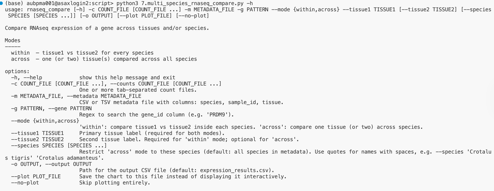

# BIOL 7180-EA1: Scripting for Biologist:

# Group Members
| Name                | Username          |Email|
| ------------------- | ----------------- |--------------|
| Melika Shiran       | Melikashiran      |mzg0146@auburn.edu|
| Sean Onileowo      | Seun-Onileowo     |sao0027@auburn.edu|
| Surma Mohiudden Meem        | surma-meem        |sum0005@auburn.edu|
| Prince Mensah Ansah | princemensahansah |pma0020@auburn.edu|

# Project Title
Germline PRMD9 expression across selected taxa.

## Project Description

Proper segregation of homologous chromosomes requires homologous recombination, which occurs during meiosis. The recombination process occurs at specific binding sites determined by PRMD9 (**DNA-binding histone methyltransferase**). PRDM9 has four functional domains conserved evolutionarily, serving as regulators of transcription. Importantly, organisms with functional gene copies of PRDM9 are known to have recombination hotspots and specific binding sequences. Whereas organisms without it initiate recombination at the promoter region. Evolutionary studies suggest that some non-avian reptile species might have lost this protein through evolution or evolved to regulate non-canonical recombination patterns. For instance, Baker et al. 2017 found orthologs of PRDM9 across distantly related vertebrates. Most taxa had partially conserved domains of the proteins. Moreover, taxa with complete conservation of all domains were those with rapid evolution of the protein’s binding affinity. The protein,PRDM9,is well-studied in mammals and other primates, and its role has been properly documented. However, studies on the presence and functions of PRDM9 (**DNA-binding histone methyltransferase**) in non-avian reptiles are still lacking. Given what is known about the protein and its functions in mammals and other primates, and its role in meiosis, it is likely to be differentially expressed across various tissues. Homologous recombination occurs during meiosis, thus, PRDM9 must be differentially upregulated in germline tissues. PRDM9 will be expressed in the germline in taxa with functional copies of the gene, whereas taxa that have lost the gene through evolution will not have it expressed. By analyzing the transcriptome of germline tissues (gonads, etc.) of non-avian reptiles, PRDM9’s expression can be ascertained.

## Method
# Methods
To test the hypothesis, we will use gonad and a control tissue (liver/heart/skin) transcriptome data from the following species: Pogona vitticeps (Georges et al. 2015), Mauremys mutica (Yuan et al. 2021), Trachemys scripta elegans (Hatkevich et al. 2025), Crotalus tigris, Hemicordylus capensis, Sceloporus undulatus, Pantherophis guttatus, Erythrolamprus reginae, Rhineura floridana, Podarcis muralis, Naja naja, Anniella stebbinsi, and Pelodiscus sinensis (Zhu et al. 2022). This RNAseq data is publicly available through NCBI. For each dataset, the paired-end .fastq R1 and R2 files will be downloaded from NCBI and brought onto the Alabama Supercomputer for analysis. After quality assessment and trimming, the reads will be aligned to the reference genome (.fasta) and annotation (.gff) files. Along with mapping, a gene count matrix file will be produced (.csv), to assess gene expression. 
The project will employ `Bash scripting` for batch processings and `Python` for data visualization


## Data availability


# Feedback

This sounds like a promising project for the class.
As you begin working on the project, think about ways you can make the Bash and
Python code flexible so that it can be easily re-used for future analyses.
For example, it would be ideal if
-   future RNAseq data can be seamlessly added.
-   you can easily change the focus from PRDM9 to other genes.

For scripting with Bash,
[this Bash style guide](https://google.github.io/styleguide/shellguide.html)
will be helpful for translating the best practices we learn in class with
Python to Bash.
For example,
[the section about comments](https://google.github.io/styleguide/shellguide.html#comments)
shows how to follow best practices for documenting Bash code (i.e., the
equivalent of docstrings in Python).

For data visualization,
[matplotlib](https://matplotlib.org/)
is the most popular Python package.
I like using
[seaborn](https://seaborn.pydata.org/), which uses matplotlib under the hood,
but has a simpler interface (in my opinion).
If you want to make interactive graphics, you can also look into
[plotly](https://plotly.com/python/)
and
[bokeh](https://bokeh.org/).

---


# Multi Species RNAseq Compare (`multi_species_rnaseq_compare.py`)

Compare RNAseq expression of a gene across tissues and species using raw count matrices.

---
## A picture of the help info


---
## Requirements

```bash
conda create -n rnaseq python=3.10
conda activate rnaseq
pip install -r requirements.txt
```

---

## Input files

### Count matrices
Tab- or comma-separated files. First column must be `gene_id`, remaining columns are sample accessions.

```
gene_id,SRR22311013,SRR22311015,SRR22311018
gene-ERLIN1|ERLIN1,4614,9028,7090
gene-PRDM9|PRDM9,0,1046,7
```

### Metadata
CSV or TSV with exactly three required columns: `sample_id`, `species`, `tissue`.

```
sample_id,species,tissue
SRR22311013,Hemicordylus capensis,Liver
SRR22311015,Hemicordylus capensis,Gonad
SRR22311018,Hemicordylus capensis,Liver
SRR15829334,Pelodiscus sinensis,Liver
SRR15315613,Pelodiscus sinensis,Gonad
```

> `sample_id` must exactly match the column headers in the count files.

---

## Modes

| Mode | Question?|
|------|------------------|
| `within` | How does expression differ between two tissues **within** each species? |
| `across` | How does expression of one tissue compare **across** species? |

---

## Use case

### Within-species: Gonad vs Liver for every species

```python
python3 multi_species_rnaseq_compare.py \
    --counts ../data/countmatrices/*.csv \
    --metadata metadata.csv \
    --gene "PRDM9" \
    --mode within \
    --tissue1 Gonad \
    --tissue2 Liver \
    --output results/prdm9_within.csv \
    --plot results/prdm9_within.png
```

Output: one grouped bar chart — species on x-axis, Gonad and Liver bars side-by-side for each.

---

### Across-species: Gonad expression in all species

```bash
python3 multi_species_rnaseq_compare.py \
    --counts ../data/countmatrices/*.csv \
    --metadata metadata.csv \
    --gene "PRDM9" \
    --mode across \
    --tissue1 Gonad \
    --output results/prdm9_across.csv \
    --plot results/prdm9_across.png
```

Output: one bar per species, coloured distinctly.

---

### Across-species: restrict to a subset of species

```bash
python3 multi_species_rnaseq_compare.py \
    --counts ../data/countmatrices/*.csv \
    --metadata metadata.csv \
    --gene "PRDM9" \
    --mode across \
    --tissue1 Gonad \
    --species "Hemicordylus capensis" "Pogona vitticeps" "Naja naja" \
    --output results/prdm9_subset.csv \
    --plot results/prdm9_subset.png
```

---

### Skip the plot (output csv only)

```bash
python3 multi_species_rnaseq_compare.py \
    --counts ../data/countmatrices/*.csv \
    --metadata metadata.csv \
    --gene "PRDM9" \
    --mode within \
    --tissue1 Gonad --tissue2 Liver \
    --output results/prdm9_within.csv \
    --no-plot
```

---

## Arguments

| Argument | Required | Description |
|----------|----------|-------------|
| `--counts` | Yes| One or more count matrix files (glob patterns accepted) |
| `--metadata` | Yes| Metadata CSV/TSV |
| `--gene` |Yes| Gene name or regex pattern to search the `gene_id` column |
| `--mode` |Yes| `within` or `across` |
| `--tissue1` |Yes| Primary tissue label |
| `--tissue2` | `within` only | Second tissue label |
| `--species` |No| Restrict `across` mode to these species |
| `--output` |No| Output CSV path (default: `expression_results.csv`) |
| `--plot` |No| Save plot to file instead of displaying interactively |
| `--no-plot` |No| Skip plotting entirely |

---

## Gene search

The `--gene` argument accepts any regular expression and is matched against the full `gene_id` string (case-insensitive).

```bash
--gene "PRDM9"          # matches gene-PRDM9|PRDM9
--gene "LOC12834"       # matches any LOC ID containing that string
--gene "^gene-ERLIN1"   # anchored match
```

> If a gene is absent from a species' count file, that file is skipped with a warning and the run continues.

> If multiple genes match your pattern, the script will prompt you to pick one interactively.

---

## Output

### Gene Expression result (CSV format)
One row per sample, written to `--output`.

```
gene_id,species,tissue,sample_id,count
gene-PRDM9|PRDM9,Hemicordylus capensis,Gonad,SRR22311015,1046
gene-PRDM9|PRDM9,Pogona vitticeps,Liver,SRR21252290,340
```

### Expression Summary
Mean ± SD printed per species × tissue before the plot is drawn.

```
=== Expression Summary (mean ± SD) ===
              species tissue  n      mean         std
Hemicordylus capensis  gonad  1    1046.0         0.0
    Pogona vitticeps  liver  2     512.0        34.6
```

---

## Common issues
The are some of the common issues one can face, using our `multi_species_rnaseq_compare.py` for your downstream analysis. In each case, we have provide a quick solution to the problem.

**Gene not found**
Run a quick grep to check the exact ID format in your files:

```bash
grep -i "PRDM9" 'species_specific_count_matrix.csv' | head
```
This will give you the ideas where the gene exist or not. Sometimes, gene names for the same gene across different species may be different. In that case you can use `sed` to edit the count matrix and rerun the script

```bash
sed 's/current gene name/actual gene name/g' name_of_file > new_name_file
# Example the P. gattus has the prdm9 as gene-LOC117677669|LOC117677669
sed 's/gene-LOC117677669|LOC117677669/gene_PRDM9|PRDM9/g' Counts_pgattus.csv > Counts_pgattus.csv 
```

**No samples collected after loading**
Check that tissue labels in `--tissue1` / `--tissue2` match the `tissue` column in your metadata (e.g. `Gonad` not `gonads`).
Make sure the name of tissue provided on th command line correspond with the name specified on the `metadata.csv`
**Wrong separator detected**
The script auto-detects: `.csv` , `.tsv` / `.txt`
Rename the file if needed.

---
## Authors
> Melika Ghasemi Siran, Prince Mensah Ansah, Sean Onileowo, Surma Mohiudden Meem 
