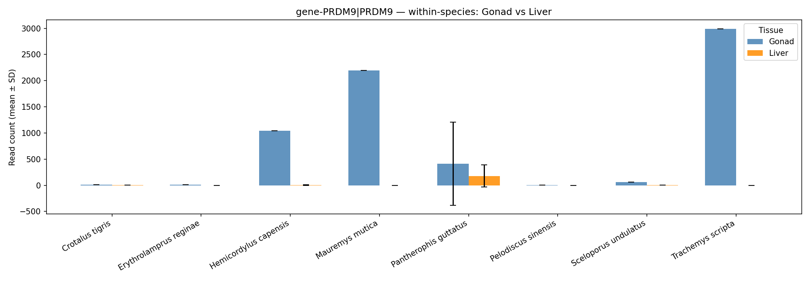
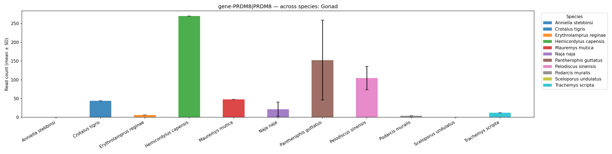
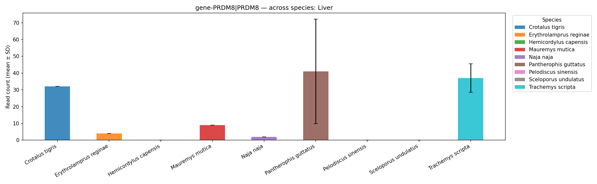

# Sample Usage

---
## Within Usage
This option or mode allows use to analyze the expression of any selected gene within the species across multiple tissues. Examples: The expression of `prdm9` across `gonad` and `liver` tissues for each species.

```python
python3 multi_species_rnaseq_compare.py \
    --counts ../data/countmatrices/*.csv \
    --metadata metadata.csv \
    --gene "PRDM9" \
    --mode within \
    --tissue1 Gonad \
    --tissue2 Liver \
    --output results/prdm9_within.csv \
    --plot results/prdm9_within.png
```
### The output
This use case produces two major output
> The clean expression count for only the selected gene 
[Expresion matrix](./prdm9_within.csv)

> The a nice visualization of the plots if `--plot` option is enabled



---

## Across Usage
This compares one tissue for multiple species
Similar output as the `within`

```python
python3 multi_species_rnaseq_compare.py \
    --counts ../data/countmatrices/*.csv \
    --metadata metadata.csv \
    --gene "PRDM9" \
    --mode across \
    --tissue1 Gonad \
    --output results/prdm9_across.csv \
    --plot results/prdm9_across.png
```

## Expression matrix
[Expresion matrix](./gonad_summary_across.csv)

## Plot
### Gonad expression across species


### Liver expression across species


---
## Important Notice
Without the `--species` flag, the script bundles all the count matrices available. If the user wants a specific species,they could select such species with the flag


---
## Authors
> Melika Ghasemi Siran, Prince Mensah Ansah, Sean Onileowo, Surma Mohiudden Meem 